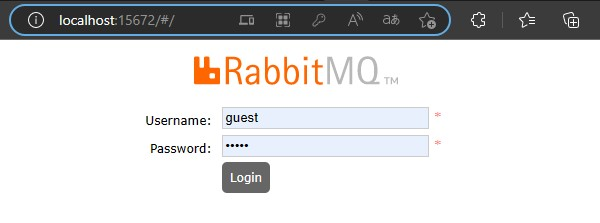
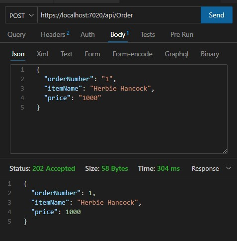
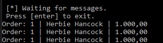
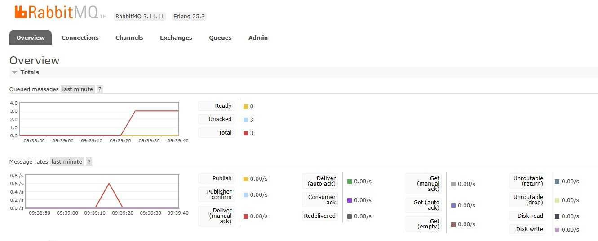

<!--  -->

<!-- 

   

 -->
# API Padrão de Fila com RabbitMQ 

### Tópicos 

- [Descrição do projeto](#descrição-do-projeto)

- [Preparação](#preparação)

- [Execução](#execução)

- [Ferramentas utilizadas](#ferramentas-utilizadas)

 

## Descrição do projeto 

Esta API foi desenvolvida para explorar o serviço de fila do <a href="https://www.rabbitmq.com/">RabbitMQ</a>

Seu conteúdo é composto de 1 API emissora e outra consumidora de elementos enviados por fila.

 

## Preparação

* Clonar a API emissora e consumidora <a href="https://github.com/medinasp/API_Worker_RabbitMQ">ApiWorkerRabbitMQ</a>

* Instalar a extensão do RabbitMQ.Client nos 2 projetos.

* Baixar e instalar o RabbitMQ Server  

* Talvez seja necessário baixar e instalar também o Erlang  

* Executar o serviço RabbitMQ no Windows, ou no SO escolhido.

* Se não der certo, navegar até a pasta de instalação do RabbitMQ Server, provavelmente c:/Arquivos de Programas/RabbitMQ server/ rabbitmq-server - x x x / sbin e rodar plugin rabbit mq - plugins enable rabbit mq - management

## Execução

* Abrir as 2 APIs em 2 Visual Studios separados.

* Executar os dois.

* Executar o endereço abaixo e acessar com as configurações. Seguem servidor e acessos padrões:
<a href="http://localhost:15672/#/">http://localhost:15672/#/</a>, username: guest, password: guest

* Com os 2 projetos rodando, abrir o testador de sua preferência, vou usar o Thunder Client no VSCode e chamar a API configurada:
https://localhost:7020/api/Order
{
  "orderNumber": "1",
  "itemName": "Herbie Hancock",
  "price": "1000"
} 
  

* Tela de execução do app enviando ordens para fila: 

* Verificar a Api sendo consumida na fila do RabbitMQ após conectar:
Repare que neste caso foram enviados 3 chamados para a fila e consumido os 3:

 

## Ferramentas utilizadas

